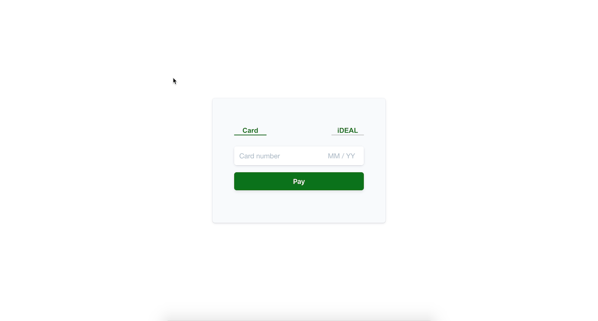

# Paying with iDEAL or Cards on the web 
The [Payment Intents API](https://stripe.com/docs/api/payment_intents) makes it simple to accept multiple payment methods on the web.

Learn how to build a payment page that can accept both iDEAL and card payments.

**Demo**

See a [hosted version](https://hhqhp.sse.codesandbox.io/) of the sample or fork a copy on [codesandbox.io](https://codesandbox.io/s/stripe-sample-web-elements-card-payment-hhqhp)

The demo is running in test mode -- use `4242424242424242` as a test card number with any CVC code + a future expiration date.

Use the `4000000000003220` test card number to trigger a 3D Secure challenge flow.

Read more about testing on Stripe at https://stripe.com/docs/testing.




## How to run locally
This sample includes 5 server implementations in Node, Ruby, Python, Java, and PHP for the two integration types: [using-webhooks](/using-webhooks) and [without-webhooks](/without-webhooks). 

If you want to run the sample locally copy the .env.example file to your own .env file: 

```
cp .env.example .env
```

Then follow the instructions in the server directory to run.

You will need a Stripe account with its own set of [API keys](https://stripe.com/docs/development#api-keys).


## FAQ
Q: Why did you pick these frameworks?

A: We chose the most minimal framework to convey the key Stripe calls and concepts you need to understand. These demos are meant as an educational tool that helps you roadmap how to integrate Stripe within your own system independent of the framework.

Q: Can you show me how to build X?

A: We are always looking for new sample ideas, please email dev-samples@stripe.com with your suggestion!

## Author(s)
[@adreyfus-stripe](https://twitter.com/adrind)
